# 🛣️ PotholeSense AI — Edge-to-Cloud Road Quality & Pothole Monitoring System

An end-to-end intelligent IoT & Computer Vision platform designed for public transit fleets and municipal patrol vehicles. The system captures road video frames on edge devices (such as Raspberry Pi), extracts real-time GPS coordinates, runs deep learning YOLOv8 pothole detection, classifies road hazard severity, performs geospatial deduplication, and streams detections to an interactive GIS dashboard with full CRUD and GeoJSON/CSV export capabilities.

---

## 🌟 System Architecture

```mermaid
flowchart LR
    subgraph Edge ["🚗 Edge Patrol Device (Raspberry Pi / Vehicle)"]
        Cam[USB / Dash Camera] --> FrameCap[Frame Capture & Throttling]
        GPS[USB GPS / gpsd] --> Fix[Coordinate & Speed Filtering]
        FrameCap & Fix --> EdgeBuffer[Memory Buffer Queue]
        EdgeBuffer --> EdgeSender[HTTP Client with Backoff Retry]
    end

    subgraph Server ["☁️ PotholeSense Cloud / Local Server"]
        DetectAPI["/detect Endpoint (FastAPI)"]
        YOLO["YOLOv8 Engine (best.pt)"]
        Dedup["Haversine Deduplication Engine"]
        Storage["Storage (Supabase Bucket / Local Static)"]
        DB["Database (Supabase PostgreSQL / SQLite)"]
        Dashboard["Interactive Web GIS Dashboard (Leaflet.js)"]
    end

    EdgeSender -- "POST /detect (JPEG + Lat/Lon)" --> DetectAPI
    DetectAPI --> YOLO
    YOLO -- "Bounding Boxes & Confidence" --> Dedup
    Dedup -- "Annotated Frames" --> Storage
    Dedup -- "Geotagged Metadata" --> DB
    DB --> Dashboard
```



---

## 📁 Repository Structure

```text
├── best.pt               # Trained YOLOv8 pothole detection model weights
├── client.py             # Edge client for Raspberry Pi / dashcam with GPS integration
├── simulate_client.py    # Route simulator script for desktop / offline testing
├── database.py           # Unified Database & Storage Adapter (Supabase & SQLite)
├── main.py               # FastAPI backend with detection pipeline & REST API
├── requirements.txt      # Python dependencies for the server & detection engine
├── schema.sql            # PostgreSQL / Supabase table definitions and spatial indexes
├── .env.example          # Environment variables configuration template
├── .env                  # Active local environment variables
├── test.jpg              # Sample road frame for testing
├── templates/
│   └── dashboard.html    # Full-featured Leaflet.js & Tailwind CSS GIS dashboard
├── pi/
│   └── requirements.txt  # Lightweight dependencies for Raspberry Pi
└── tests/
    └── test_server.py    # Automated test suite (pytest)
```

---

## 🚀 Quick Start Guide

### 1. Installation

Ensure you have Python 3.10+ installed.

```bash
# Install server dependencies
pip install -r requirements.txt
```

### 2. Configure Environment (`.env`)

A default `.env` file is already provided. By default, the system runs in **Zero-Config Local Mode** (using local SQLite and local static storage), so you can start right away without setting up cloud accounts!

If you wish to use Supabase Cloud:
1. Create a Supabase project at [supabase.com](https://supabase.com).
2. Execute `schema.sql` in the Supabase SQL Editor.
3. Create a public Storage bucket named `potholes`.
4. Update `.env` with your Supabase credentials:

```dotenv
API_KEY=test-api-key-12345
SUPABASE_URL=https://your-project.supabase.co
SUPABASE_SERVICE_KEY=your-supabase-service-role-key
SUPABASE_BUCKET=potholes
MODEL_PATH=best.pt
CONF_THRESHOLD=0.40
DEDUP_METERS=12
DEDUP_SECONDS=600
```

### 3. Launch the Server

```bash
uvicorn main:app --host 0.0.0.0 --port 8000 --reload
```

- **Interactive Dashboard**: Open [http://localhost:8000/](http://localhost:8000/) in your web browser.
- **Interactive Swagger API Docs**: Open [http://localhost:8000/docs](http://localhost:8000/docs).

---

## 🧪 Testing & Simulation

### Option A: Interactive Web UI Tester
1. Open [http://localhost:8000/](http://localhost:8000/).
2. Switch to the **"AI Frame Tester"** tab.
3. Click **"Load test.jpg"** (or upload your own road image).
4. Click **"Run Pothole Detection"**.
5. Watch the detection appear live with bounding boxes and drop a marker pin on the map!

### Option B: Automated Route Simulation
Run the route simulation script to simulate a vehicle driving along a corridor and sending geotagged frames:

```bash
python simulate_client.py
```

### Option C: Run Unit & Integration Tests
Execute the automated pytest suite:

```bash
python -m pytest tests/test_server.py -v
```

---

## 📱 Edge Patrol Client (Raspberry Pi Setup)

To deploy on a Raspberry Pi or in-vehicle computer:

### 1. Hardware Setup
- Connect a USB webcam (or Raspberry Pi Camera Module).
- Connect a USB GPS receiver (e.g. u-blox 7 / VK-162).

### 2. System Packages & GPS Daemon
```bash
sudo apt update
sudo apt install gpsd gpsd-clients python3-pip
```

Confirm GPS satellite lock:
```bash
cgps -s
```

### 3. Install Edge Dependencies
```bash
pip install -r pi/requirements.txt
```

### 4. Launch Edge Client
```bash
SERVER_URL="http://your-server-ip:8000" \
API_KEY="test-api-key-12345" \
DEVICE_ID="bus-01" \
python client.py
```

*Note: If testing on a PC without GPS hardware, `client.py` automatically detects the absence of `gpsd` and falls back to simulated GPS movement.*

---

## 📡 REST API Reference

| Method | Endpoint | Description | Auth Required |
|---|---|---|---|
| `GET` | `/` | Web GIS Interactive Map & Analytics Dashboard | No |
| `GET` | `/health` | System health, model info, and active storage backend | No |
| `POST` | `/detect` | Uploads frame, runs YOLO inference, deduplicates, and logs incident | `x-api-key` |
| `GET` | `/potholes` | Lists pothole records with filters (`severity`, `status`, `device_id`) | No |
| `GET` | `/potholes/{id}` | Retrieves details for a specific pothole | No |
| `PATCH` | `/potholes/{id}` | Updates status (`open`, `in_progress`, `fixed`) | `x-api-key` |
| `DELETE` | `/potholes/{id}` | Deletes a pothole record | `x-api-key` |
| `GET` | `/potholes/stats` | Aggregated KPIs and metrics for charts and dashboards | No |
| `GET` | `/potholes/export/geojson` | Exports all incidents as an RFC 7946 GeoJSON FeatureCollection | No |
| `GET` | `/potholes/export/csv` | Exports incidents as CSV for spreadsheet analysis | No |

### Sample cURL Detection Request:
```bash
curl -X POST http://localhost:8000/detect \
  -H "x-api-key: test-api-key-12345" \
  -F "frame=@test.jpg" \
  -F "lat=19.9975" \
  -F "lon=73.7898" \
  -F "device_id=bus-01"
```

---

## 🛡️ Deduplication & Severity Logic

- **Spatial-Temporal Deduplication**: Detections within `DEDUP_METERS` (default: 12 meters) and within `DEDUP_SECONDS` (default: 600s / 10 mins) are recognized as duplicate sightings of the same pothole. They are acknowledged without polluting the database with redundant entries.
- **Severity Rating**:
  - `low`: Normalized bounding box area $< 1\%$ of frame
  - `medium`: Area between $1\%$ and $3\%$
  - `high`: Area $\ge 3\%$ of frame (triggers highlighted visual alert on GIS dashboard)
